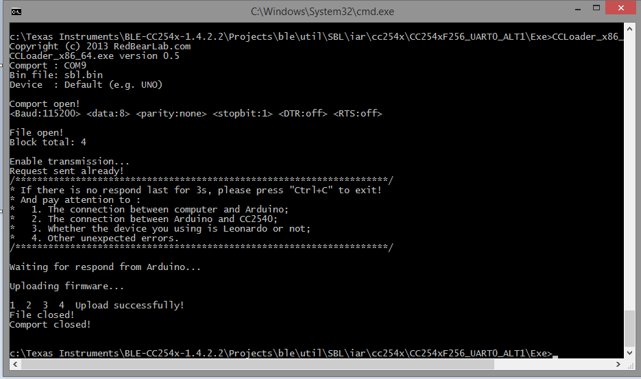

# 2.4-GHz Bluetooth™ low energy and Proprietary System-on-Chip flash loader based on STM32VLDISCOVERY

Burn CC254x firmware using an STM discovery board.

## Getting Started

Compile project CC_debug.uvprojx from Keil IDE and downloading into STM32VLDISCOVERY 

connect to target, run CCLoader_x86_64.exe [RedBearLab](https://github.com/RedBearLab/CCLoader) and burn it.

